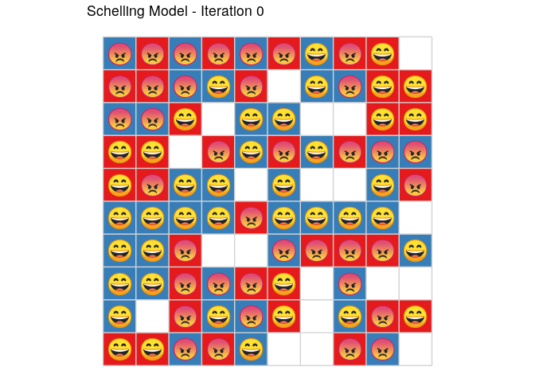

<!-- README.md is generated from README.Rmd. Please edit that file -->

# SchellingR

The goal of SchellingR is to run the Schelling (1971) agent-based model
(ABM) of urban migration and segregation. The ABM is written in C++ to
allow for fast and efficient calculations. Summary statistics of each
round are reported back to R.

## Installation

You can install SchellingR from github with:

``` r
# install.packages("devtools")
devtools::install_github("DavZim/SchellingR")
```

## Example

The base function of the package is `run_schelling()` which returns a
list of two data.frames `round` and `detailed`. The former contains
aggregated statistics per round, i.e., the number of happy/unhappy
agents and the number of moves, the latter contains agent-level
information about the grid, the agents, and their neighbors.

The function allows you to tweak basic inputs to the model, such as grid
size `size`, the percent of empty grid-cells `percent_empty`, the
threshold above which agents are considered to be happy `threshold`, the
number of groups to simulated `number_of_groups`, the maximum number of
simulation rounds `max_rounds`, and a seed for the random number
generator `seed`.

``` r
library(SchellingR)
set.seed(1234567)

sh <- run_schelling(size = 10, percent_empty = 0.2, threshold = 0.5, number_of_groups = 2, max_rounds = 100)

str(sh)
#> List of 2
#>  $ round   :Classes 'tbl_df', 'tbl' and 'data.frame':    11 obs. of  4 variables:
#>   ..$ round         : int [1:11] 0 1 2 3 4 5 6 7 8 9 ...
#>   ..$ happy_agents  : int [1:11] 42 54 68 73 75 76 77 78 79 79 ...
#>   ..$ unhappy_agents: int [1:11] 38 26 12 7 5 4 3 2 1 1 ...
#>   ..$ number_moves  : int [1:11] 0 38 26 12 7 5 4 3 2 1 ...
#>  $ detailed:Classes 'tbl_df', 'tbl' and 'data.frame':    1100 obs. of  8 variables:
#>   ..$ round      : int [1:1100] 0 0 0 0 0 0 0 0 0 0 ...
#>   ..$ x          : int [1:1100] 1 2 3 4 5 6 7 8 9 10 ...
#>   ..$ y          : int [1:1100] 10 10 10 10 10 10 10 10 10 10 ...
#>   ..$ id         : int [1:1100] 0 1 2 3 4 5 6 7 8 0 ...
#>   ..$ group      : int [1:1100] 2 1 2 1 2 1 2 1 1 0 ...
#>   ..$ n_same     : int [1:1100] 0 2 2 1 1 1 2 2 3 0 ...
#>   ..$ n_different: int [1:1100] 3 3 3 4 3 3 2 3 1 0 ...
#>   ..$ happy      : int [1:1100] 0 0 0 0 0 0 1 0 1 0 ...
```

**For full functionality, you need to have the additional packages
installed** - `gganimate` for animation (gifs) - `emojifont` for emojis
- `magick` for combining gifs

## Visualisation

After running the simulation, we can plot the average happiness per
round using `dplyr` and `ggplot2`.

``` r
plot_development(sh)
```

<!-- -->

We can also use the detailed information to plot the grid at certain
steps.

``` r
plot_grid(sh, select_round = 8, title = TRUE)
```

<!-- -->

## Animation

Using the wonderful [gganimate](https://github.com/thomasp85/gganimate)
package, we can also create an animation of the model

``` r
plot_grid(sh, title = TRUE, animate = TRUE)
```

<!-- -->

If you want to get even fancier, you can also use the
[emojifont](https://CRAN.R-project.org/package=emojifont) package to
make the agent’s state more intuitive.

``` r
plot_grid(sh, select_round = 8, title = TRUE, emoji = TRUE)
```

<!-- -->

Or you can use both options at the same time.

``` r
plot_grid(sh, title = TRUE, emoji = TRUE, animate = TRUE)
```

<!-- -->

## More Complex Example

To give a more complex example on a larger grid with 7
groups:

``` r
sh2 <- run_schelling(size = 30, number_of_groups = 4, max_rounds = 1000, seed = 1234567)

dev <- plot_development(sh2, animate = TRUE)

grid <- plot_grid(sh2, title = TRUE, grid = FALSE, animate = TRUE)

combined <- combine_gifs(grid, dev)
print(combined)
#> # A tibble: 100 x 7
#>    format width height colorspace matte filesize density
#>    <chr>  <int>  <int> <chr>      <lgl>    <int> <chr>  
#>  1 GIF     1344    480 sRGB       TRUE         0 72x72  
#>  2 GIF     1344    480 sRGB       TRUE         0 72x72  
#>  3 GIF     1344    480 sRGB       TRUE         0 72x72  
#>  4 GIF     1344    480 sRGB       TRUE         0 72x72  
#>  5 GIF     1344    480 sRGB       TRUE         0 72x72  
#>  6 GIF     1344    480 sRGB       TRUE         0 72x72  
#>  7 GIF     1344    480 sRGB       TRUE         0 72x72  
#>  8 GIF     1344    480 sRGB       TRUE         0 72x72  
#>  9 GIF     1344    480 sRGB       TRUE         0 72x72  
#> 10 GIF     1344    480 sRGB       TRUE         0 72x72  
#> # … with 90 more rows
```

<!-- -->
